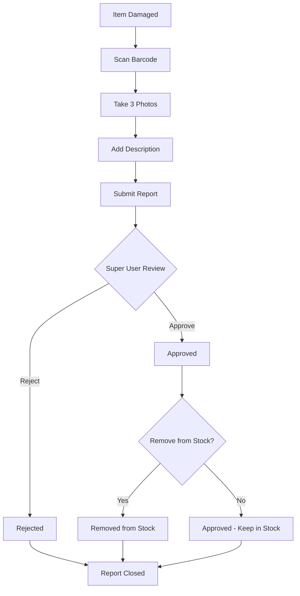

# Damaged Goods System - Comprehensive Implementation Guide

**Project**: Stock Audit Scanner System  
**Feature**: Session-Scoped Damage Reporting with Web Camera Integration  
**Created**: August 18, 2025  
**Version**: 1.0  
**Deployment**: PRODUCTION READY

---

## 🚨 CRITICAL PRODUCTION DEPLOYMENT WARNING

**This implementation is being deployed DIRECTLY to production. Follow these mandatory steps:**

### **⚠️ PRE-DEPLOYMENT REQUIREMENTS**
- [ ] **BACKUP DATABASE**: Full backup before any schema changes
- [ ] **HTTPS VERIFIED**: Camera API requires secure connection
- [ ] **STORAGE LIMITS**: Monitor Supabase free tier (1GB) usage
- [ ] **USER PERMISSIONS**: Test with actual user accounts, not admin
- [ ] **CAMERA ACCESS**: Verify laptop cameras work at scanning stations

### **🔴 PRODUCTION RISKS TO MONITOR**
1. **Camera Permission Failures**: Users may deny camera access
2. **Storage Capacity**: Image uploads could fill 1GB quickly
3. **HTTPS Certificate Issues**: Camera won't work without valid SSL
4. **Database Migration Errors**: Schema changes could break existing system
5. **Upload Speed**: Large images may timeout on slow connections

### **📞 EMERGENCY ROLLBACK PLAN**
If critical issues occur:
1. Disable damage reporting in navigation (comment out menu item)
2. Restore database from pre-migration backup
3. Contact support: Issues should be reported immediately

---

## Table of Contents

1. [System Overview](#system-overview)
2. [Database Schema Design](#database-schema-design)
3. [Web Camera Implementation](#web-camera-implementation)
4. [User Interface Components](#user-interface-components)
5. [Storage & Performance Optimization](#storage--performance-optimization)
6. [User Workflows & Permissions](#user-workflows--permissions)
7. [Technical Implementation Details](#technical-implementation-details)
8. [Hardware Requirements & Setup](#hardware-requirements--setup)
9. [Testing & Deployment Plan](#testing--deployment-plan)
10. [Production Monitoring & Maintenance](#production-monitoring--maintenance)
11. [Future Enhancements](#future-enhancements)

---

## System Overview

### **Purpose**
Enable users to report damaged inventory items during audit sessions with photo documentation, providing super users with an approval workflow to remove damaged items from stock.

### **Key Features**
- **Session Integration**: Damage reports tied to active audit sessions
- **Web Camera Capture**: 3-photo documentation using laptop cameras
- **Image Compression**: Optimized for Supabase free tier (1GB storage)
- **Approval Workflow**: Super user-only approval with stock removal tracking
- **Storage Monitoring**: Usage tracking and cleanup procedures

### **User Flow Summary**
```
Scanner finds damage → Scan barcode → Take 3 photos → Add description → Submit
↓
Super user reviews → Approve/Reject with notes → Optional stock removal
↓
Damage becomes part of audit session findings and reports
```

---

## Database Schema Design

### **Core Tables**

#### **1. Damaged Items Table**
```sql
-- Main damage reports table
CREATE TABLE damaged_items (
    id UUID PRIMARY KEY DEFAULT uuid_generate_v4(),
    audit_session_id UUID NOT NULL REFERENCES audit_sessions(id) ON DELETE CASCADE,
    barcode VARCHAR(50) NOT NULL,
    reported_by UUID NOT NULL REFERENCES users(id),
    reported_at TIMESTAMPTZ DEFAULT NOW(),
    damage_description TEXT,
    damage_severity damage_severity_enum DEFAULT 'medium',
    status damage_status_enum DEFAULT 'pending',
    approved_by UUID REFERENCES users(id),
    approved_at TIMESTAMPTZ,
    rejection_reason TEXT,
    removed_from_stock BOOLEAN DEFAULT false,
    removed_at TIMESTAMPTZ,
    removed_by UUID REFERENCES users(id),
    estimated_loss_value DECIMAL(10,2),
    created_at TIMESTAMPTZ DEFAULT NOW(),
    updated_at TIMESTAMPTZ DEFAULT NOW()
);

-- Indexes for performance
CREATE INDEX idx_damaged_items_session ON damaged_items(audit_session_id);
CREATE INDEX idx_damaged_items_status ON damaged_items(status);
CREATE INDEX idx_damaged_items_reported_by ON damaged_items(reported_by);
CREATE INDEX idx_damaged_items_barcode ON damaged_items(barcode);
```

#### **2. Damage Images Table**
```sql
-- Store 3 photos per damage report
CREATE TABLE damage_images (
    id UUID PRIMARY KEY DEFAULT uuid_generate_v4(),
    damaged_item_id UUID NOT NULL REFERENCES damaged_items(id) ON DELETE CASCADE,
    image_url TEXT NOT NULL,
    image_filename VARCHAR(255) NOT NULL,
    image_order INTEGER NOT NULL CHECK (image_order BETWEEN 1 AND 3),
    file_size_bytes INTEGER,
    mime_type VARCHAR(50) DEFAULT 'image/jpeg',
    uploaded_at TIMESTAMPTZ DEFAULT NOW(),
    UNIQUE(damaged_item_id, image_order)
);

-- Index for efficient image retrieval
CREATE INDEX idx_damage_images_item ON damage_images(damaged_item_id);
```

#### **3. Enum Types**
```sql
-- Damage status workflow
CREATE TYPE damage_status_enum AS ENUM (
    'pending',
    'approved', 
    'rejected',
    'removed_from_stock'
);

-- Damage severity levels
CREATE TYPE damage_severity_enum AS ENUM (
    'minor',     -- Cosmetic damage
    'medium',    -- Functional impact
    'severe',    -- Unusable/safety hazard
    'total_loss' -- Complete destruction
);
```

#### **4. Database Functions**

```sql
-- Get pending damage reports for approval
CREATE OR REPLACE FUNCTION get_pending_damage_reports(p_user_id UUID)
RETURNS TABLE (
    damage_id UUID,
    barcode VARCHAR,
    damage_description TEXT,
    damage_severity damage_severity_enum,
    reported_by_name VARCHAR,
    reported_at TIMESTAMPTZ,
    session_shortname VARCHAR,
    location_name VARCHAR,
    image_count BIGINT
)
LANGUAGE plpgsql
SECURITY DEFINER
AS $$
BEGIN
    -- Only super users can access this function
    IF NOT EXISTS (
        SELECT 1 FROM users 
        WHERE id = p_user_id AND role = 'superuser'
    ) THEN
        RAISE EXCEPTION 'Access denied: Super user role required';
    END IF;

    RETURN QUERY
    SELECT 
        d.id as damage_id,
        d.barcode,
        d.damage_description,
        d.damage_severity,
        COALESCE(u.full_name, u.username) as reported_by_name,
        d.reported_at,
        a.shortname as session_shortname,
        l.name as location_name,
        COUNT(i.id) as image_count
    FROM damaged_items d
    INNER JOIN users u ON u.id = d.reported_by
    INNER JOIN audit_sessions a ON a.id = d.audit_session_id
    INNER JOIN locations l ON l.id = a.location_id
    LEFT JOIN damage_images i ON i.damaged_item_id = d.id
    WHERE d.status = 'pending'
    GROUP BY d.id, d.barcode, d.damage_description, d.damage_severity,
             u.full_name, u.username, d.reported_at, a.shortname, l.name
    ORDER BY d.reported_at ASC;
END;
$$;

-- Approve damage report
CREATE OR REPLACE FUNCTION approve_damage_report(
    p_damage_id UUID,
    p_approved_by UUID,
    p_remove_from_stock BOOLEAN DEFAULT false
)
RETURNS VOID
LANGUAGE plpgsql
SECURITY DEFINER
AS $$
BEGIN
    -- Verify super user permission
    IF NOT EXISTS (
        SELECT 1 FROM users 
        WHERE id = p_approved_by AND role = 'superuser'
    ) THEN
        RAISE EXCEPTION 'Access denied: Super user role required';
    END IF;

    -- Update damage report
    UPDATE damaged_items 
    SET 
        status = CASE 
            WHEN p_remove_from_stock THEN 'removed_from_stock'::damage_status_enum 
            ELSE 'approved'::damage_status_enum 
        END,
        approved_by = p_approved_by,
        approved_at = NOW(),
        removed_from_stock = p_remove_from_stock,
        removed_at = CASE WHEN p_remove_from_stock THEN NOW() ELSE NULL END,
        removed_by = CASE WHEN p_remove_from_stock THEN p_approved_by ELSE NULL END,
        updated_at = NOW()
    WHERE id = p_damage_id;

    IF NOT FOUND THEN
        RAISE EXCEPTION 'Damage report not found: %', p_damage_id;
    END IF;
END;
$$;

-- Get damage summary by audit session
CREATE OR REPLACE FUNCTION get_session_damage_summary(p_session_id UUID)
RETURNS TABLE (
    total_damage_reports BIGINT,
    pending_reports BIGINT,
    approved_reports BIGINT,
    rejected_reports BIGINT,
    removed_from_stock BIGINT,
    estimated_total_loss DECIMAL
)
LANGUAGE plpgsql
AS $$
BEGIN
    RETURN QUERY
    SELECT 
        COUNT(*) as total_damage_reports,
        COUNT(*) FILTER (WHERE status = 'pending') as pending_reports,
        COUNT(*) FILTER (WHERE status = 'approved') as approved_reports,
        COUNT(*) FILTER (WHERE status = 'rejected') as rejected_reports,
        COUNT(*) FILTER (WHERE removed_from_stock = true) as removed_from_stock,
        COALESCE(SUM(estimated_loss_value), 0) as estimated_total_loss
    FROM damaged_items
    WHERE audit_session_id = p_session_id;
END;
$$;
```

---

## Web Camera Implementation

### **Camera Access & Initialization**

#### **Browser Camera API**
```javascript
// Camera utility functions
export class DamageCameraService {
    constructor() {
        this.stream = null;
        this.canvas = null;
    }

    // Initialize camera with optimal settings for damage documentation
    async initializeCamera() {
        try {
            // Check if getUserMedia is supported
            if (!navigator.mediaDevices || !navigator.mediaDevices.getUserMedia) {
                throw new Error('Camera API not supported in this browser');
            }

            // Check if HTTPS is enabled (required for camera access)
            if (location.protocol !== 'https:' && location.hostname !== 'localhost') {
                throw new Error('Camera access requires HTTPS connection');
            }

            const constraints = {
                video: {
                    width: { ideal: 1920, max: 1920 },
                    height: { ideal: 1080, max: 1080 },
                    facingMode: 'environment', // Prefer back camera if available
                    aspectRatio: 16/9
                },
                audio: false
            };

            this.stream = await navigator.mediaDevices.getUserMedia(constraints);
            return this.stream;
        } catch (error) {
            console.error('Camera initialization failed:', error);
            
            // Provide specific error messages for common issues
            if (error.name === 'NotAllowedError') {
                throw new Error('Camera access denied. Please allow camera permissions and refresh.');
            } else if (error.name === 'NotFoundError') {
                throw new Error('No camera found. Please connect a camera and refresh.');
            } else if (error.name === 'NotSupportedError') {
                throw new Error('Camera not supported by this browser. Use Chrome, Edge, or Firefox.');
            } else if (error.message.includes('HTTPS')) {
                throw new Error('Camera requires secure connection (HTTPS). Please use HTTPS URL.');
            } else {
                throw new Error(`Camera unavailable: ${error.message}`);
            }
        }
    }

    // Capture photo from video stream
    capturePhoto(videoElement) {
        if (!this.canvas) {
            this.canvas = document.createElement('canvas');
        }

        const video = videoElement;
        this.canvas.width = video.videoWidth;
        this.canvas.height = video.videoHeight;

        const ctx = this.canvas.getContext('2d');
        ctx.drawImage(video, 0, 0);

        return this.canvas.toDataURL('image/jpeg', 0.8);
    }

    // Compress image to target size
    async compressImage(dataUrl, targetSizeKB = 250) {
        return new Promise((resolve) => {
            const img = new Image();
            img.onload = () => {
                const canvas = document.createElement('canvas');
                const ctx = canvas.getContext('2d');

                // Calculate optimal dimensions (max 1200x800)
                const maxWidth = 1200;
                const maxHeight = 800;
                let { width, height } = img;

                if (width > height) {
                    if (width > maxWidth) {
                        height = (height * maxWidth) / width;
                        width = maxWidth;
                    }
                } else {
                    if (height > maxHeight) {
                        width = (width * maxHeight) / height;
                        height = maxHeight;
                    }
                }

                canvas.width = width;
                canvas.height = height;

                // Draw and compress
                ctx.drawImage(img, 0, 0, width, height);
                
                // Start with quality 0.8, reduce if needed
                let quality = 0.8;
                let compressedDataUrl = canvas.toDataURL('image/jpeg', quality);
                
                // Reduce quality until under target size
                while (this.getImageSizeKB(compressedDataUrl) > targetSizeKB && quality > 0.3) {
                    quality -= 0.1;
                    compressedDataUrl = canvas.toDataURL('image/jpeg', quality);
                }

                resolve(compressedDataUrl);
            };
            img.src = dataUrl;
        });
    }

    // Calculate image size in KB
    getImageSizeKB(dataUrl) {
        const base64Length = dataUrl.length - (dataUrl.indexOf(',') + 1);
        return (base64Length * 0.75) / 1024; // Base64 to bytes to KB
    }

    // Cleanup camera resources
    stopCamera() {
        if (this.stream) {
            this.stream.getTracks().forEach(track => track.stop());
            this.stream = null;
        }
    }
}
```

### **Progressive Photo Capture Component**

```tsx
// DamageCameraCapture.tsx
import React, { useState, useRef, useEffect } from 'react';
import {
    Box,
    Button,
    Typography,
    Stepper,
    Step,
    StepLabel,
    Alert,
    CircularProgress
} from '@mui/material';
import { CameraAlt, Refresh, Check } from '@mui/icons-material';

interface DamageCameraCaptureProps {
    onPhotosCapture: (photos: CapturedPhoto[]) => void;
    onCancel: () => void;
}

interface CapturedPhoto {
    dataUrl: string;
    order: number;
    sizeKB: number;
    timestamp: string;
}

const PHOTO_INSTRUCTIONS = [
    {
        title: "Overall View",
        description: "Position the damaged item in the center of the frame. Take a wide shot showing the entire item."
    },
    {
        title: "Damage Close-up", 
        description: "Move closer and focus on the damaged area. Ensure the damage is clearly visible."
    },
    {
        title: "Side Angle",
        description: "Take a side view to show the depth and extent of the damage."
    }
];

export default function DamageCameraCapture({ onPhotosCapture, onCancel }: DamageCameraCaptureProps) {
    const [currentStep, setCurrentStep] = useState(0);
    const [photos, setPhotos] = useState<CapturedPhoto[]>([]);
    const [cameraReady, setCameraReady] = useState(false);
    const [error, setError] = useState<string | null>(null);
    const [processing, setProcessing] = useState(false);
    
    const videoRef = useRef<HTMLVideoElement>(null);
    const cameraService = useRef(new DamageCameraService());

    useEffect(() => {
        initializeCamera();
        return () => cameraService.current.stopCamera();
    }, []);

    const initializeCamera = async () => {
        try {
            const stream = await cameraService.current.initializeCamera();
            if (videoRef.current) {
                videoRef.current.srcObject = stream;
                setCameraReady(true);
            }
        } catch (error) {
            setError('Unable to access camera. Please ensure camera permissions are granted.');
        }
    };

    const capturePhoto = async () => {
        if (!videoRef.current || !cameraReady) return;

        setProcessing(true);
        try {
            // Capture raw photo
            const rawDataUrl = cameraService.current.capturePhoto(videoRef.current);
            
            // Compress to target size (250KB)
            const compressedDataUrl = await cameraService.current.compressImage(rawDataUrl, 250);
            
            const photo: CapturedPhoto = {
                dataUrl: compressedDataUrl,
                order: currentStep + 1,
                sizeKB: Math.round(cameraService.current.getImageSizeKB(compressedDataUrl)),
                timestamp: new Date().toISOString()
            };

            const newPhotos = [...photos, photo];
            setPhotos(newPhotos);

            // Move to next step or complete
            if (currentStep < 2) {
                setCurrentStep(currentStep + 1);
            } else {
                // All photos captured
                onPhotosCapture(newPhotos);
            }
        } catch (error) {
            setError('Failed to capture photo. Please try again.');
        } finally {
            setProcessing(false);
        }
    };

    const retakePhoto = () => {
        // Remove last photo and go back one step
        const newPhotos = photos.slice(0, -1);
        setPhotos(newPhotos);
        if (currentStep > 0) {
            setCurrentStep(currentStep - 1);
        }
    };

    if (error) {
        return (
            <Box sx={{ p: 3, textAlign: 'center' }}>
                <Alert severity="error" sx={{ mb: 2 }}>
                    {error}
                </Alert>
                <Button onClick={onCancel} variant="outlined">
                    Cancel
                </Button>
                <Button onClick={initializeCamera} variant="contained" sx={{ ml: 2 }}>
                    Retry Camera Access
                </Button>
            </Box>
        );
    }

    return (
        <Box sx={{ p: 3 }}>
            {/* Progress Stepper */}
            <Stepper activeStep={currentStep} sx={{ mb: 3 }}>
                {PHOTO_INSTRUCTIONS.map((instruction, index) => (
                    <Step key={index} completed={index < photos.length}>
                        <StepLabel>{instruction.title}</StepLabel>
                    </Step>
                ))}
            </Stepper>

            {/* Current Instruction */}
            {currentStep < 3 && (
                <Alert severity="info" sx={{ mb: 3 }}>
                    <Typography variant="subtitle2" gutterBottom>
                        Photo {currentStep + 1} of 3: {PHOTO_INSTRUCTIONS[currentStep].title}
                    </Typography>
                    <Typography variant="body2">
                        {PHOTO_INSTRUCTIONS[currentStep].description}
                    </Typography>
                </Alert>
            )}

            {/* Camera Feed */}
            <Box sx={{ display: 'flex', justifyContent: 'center', mb: 3 }}>
                <Box sx={{ position: 'relative', borderRadius: 2, overflow: 'hidden' }}>
                    <video
                        ref={videoRef}
                        autoPlay
                        playsInline
                        style={{
                            width: '100%',
                            maxWidth: 640,
                            height: 'auto',
                            display: cameraReady ? 'block' : 'none'
                        }}
                    />
                    {!cameraReady && (
                        <Box sx={{ 
                            width: 640, 
                            height: 480, 
                            display: 'flex', 
                            alignItems: 'center', 
                            justifyContent: 'center',
                            bgcolor: 'grey.200'
                        }}>
                            <CircularProgress />
                        </Box>
                    )}
                </Box>
            </Box>

            {/* Photo Preview Row */}
            {photos.length > 0 && (
                <Box sx={{ display: 'flex', gap: 1, mb: 3, justifyContent: 'center' }}>
                    {photos.map((photo, index) => (
                        <Box key={index} sx={{ textAlign: 'center' }}>
                            
                            <Typography variant="caption" display="block">
                                {photo.sizeKB}KB
                            </Typography>
                        </Box>
                    ))}
                </Box>
            )}

            {/* Action Buttons */}
            <Box sx={{ display: 'flex', justifyContent: 'center', gap: 2 }}>
                <Button onClick={onCancel} variant="outlined">
                    Cancel
                </Button>
                
                {photos.length > 0 && (
                    <Button onClick={retakePhoto} variant="outlined" startIcon={<Refresh />}>
                        Retake Last
                    </Button>
                )}

                <Button
                    onClick={capturePhoto}
                    variant="contained"
                    disabled={!cameraReady || processing}
                    startIcon={processing ? <CircularProgress size={20} /> : <CameraAlt />}
                >
                    {processing ? 'Processing...' : 
                     currentStep < 2 ? `Capture Photo ${currentStep + 1}` : 'Capture Final Photo'}
                </Button>
            </Box>
        </Box>
    );
}
```

---

## Frontend Integration

### **Navigation Menu Updates**

#### **Step 1: Update DashboardLayout Navigation**
Add damage reporting routes to the main navigation:

```tsx
// dashboard/src/components/DashboardLayout.tsx
// Add to existing imports
import { Warning, Gavel } from '@mui/icons-material';

const getNavigationItems = () => {
    const baseItems = [
      { text: 'Dashboard', icon: <Dashboard />, href: '/dashboard' },
    ]

    // Add scanning for all users who can scan (scanner, supervisor, superuser)
    if (currentUser && ['scanner', 'supervisor', 'superuser'].includes(currentUser.role)) {
      baseItems.push(
        { text: 'Scanning', icon: <QrCodeScanner />, href: '/dashboard/scanning' },
        { text: 'Damage Reports', icon: <Warning />, href: '/dashboard/damage' }
      )
    }

    // Add other items based on role
    if (currentUser && ['supervisor', 'superuser'].includes(currentUser.role)) {
      baseItems.push(
        { text: 'Approvals', icon: <CheckCircle />, href: '/dashboard/approvals' },
        { text: 'Reports', icon: <Assessment />, href: '/dashboard/reports' },
      )
    }

    // Super user gets damage approvals
    if (currentUser && currentUser.role === 'superuser') {
      baseItems.push(
        { text: 'Damage Approvals', icon: <Gavel />, href: '/dashboard/damage-approvals' }
      )
    }

    // Settings for all users
    if (currentUser) {
      baseItems.push({ text: 'Settings', icon: <Settings />, href: '/dashboard/settings' })
    }

    return baseItems
}
```

#### **Step 2: Create Route Files**
```bash
# Create new page files
mkdir -p dashboard/src/app/dashboard/damage
mkdir -p dashboard/src/app/dashboard/damage-approvals

# Create page components
touch dashboard/src/app/dashboard/damage/page.tsx
touch dashboard/src/app/dashboard/damage-approvals/page.tsx
```

#### **Step 3: Component File Structure**
```bash
# Create component directory structure
mkdir -p dashboard/src/components/damage

# Create all required component files
touch dashboard/src/components/damage/DamageReportingPage.tsx
touch dashboard/src/components/damage/DamageApprovalPage.tsx
touch dashboard/src/components/damage/DamageCameraCapture.tsx
touch dashboard/src/components/damage/BarcodeScanner.tsx
touch dashboard/src/components/damage/StorageMonitoring.tsx

# Create service files
mkdir -p dashboard/src/services
touch dashboard/src/services/DamageCameraService.ts
```

#### **Step 4: Route Implementations**
```tsx
// dashboard/src/app/dashboard/damage/page.tsx
'use client'
import DashboardLayout from '@/components/DashboardLayout'
import DamageReportingPage from '@/components/damage/DamageReportingPage'

export default function DamagePage() {
  return (
    <DashboardLayout>
      <DamageReportingPage />
    </DashboardLayout>
  )
}

// dashboard/src/app/dashboard/damage-approvals/page.tsx  
'use client'
import DashboardLayout from '@/components/DashboardLayout'
import DamageApprovalPage from '@/components/damage/DamageApprovalPage'

export default function DamageApprovalsPage() {
  return (
    <DashboardLayout>
      <DamageApprovalPage />
    </DashboardLayout>
  )
}
```

---

## User Interface Components

### **Main Damage Reporting Interface**

```tsx
// DamageReportingPage.tsx
import React, { useState, useEffect } from 'react';
import {
    Container,
    Typography,
    Card,
    CardContent,
    TextField,
    Button,
    Box,
    Stepper,
    Step,
    StepLabel,
    Alert,
    FormControl,
    InputLabel,
    Select,
    MenuItem
} from '@mui/material';
import { CameraAlt, Send } from '@mui/icons-material';
import DamageCameraCapture from './DamageCameraCapture';
import BarcodeScanner from './BarcodeScanner';

interface DamageReport {
    barcode: string;
    description: string;
    severity: 'minor' | 'medium' | 'severe' | 'total_loss';
    photos: CapturedPhoto[];
}

const SEVERITY_OPTIONS = [
    { value: 'minor', label: 'Minor - Cosmetic damage only' },
    { value: 'medium', label: 'Medium - Functional impact' },
    { value: 'severe', label: 'Severe - Unusable/safety hazard' },
    { value: 'total_loss', label: 'Total Loss - Complete destruction' }
];

export default function DamageReportingPage() {
    const [currentStep, setCurrentStep] = useState(0);
    const [damageReport, setDamageReport] = useState<Partial<DamageReport>>({});
    const [activeSession, setActiveSession] = useState<any>(null);
    const [submitting, setSubmitting] = useState(false);
    const [error, setError] = useState<string | null>(null);

    useEffect(() => {
        loadActiveSession();
    }, []);

    const loadActiveSession = async () => {
        // Load current active audit session
        const { data, error } = await supabase
            .from('audit_sessions')
            .select('id, shortname, location_id, locations(name)')
            .eq('status', 'active')
            .single();
            
        if (data) {
            setActiveSession(data);
        } else {
            setError('No active audit session found. Please start an audit session first.');
        }
    };

    const handleBarcodeScanned = (barcode: string) => {
        setDamageReport(prev => ({ ...prev, barcode }));
        setCurrentStep(1);
    };

    const handlePhotosCapture = (photos: CapturedPhoto[]) => {
        setDamageReport(prev => ({ ...prev, photos }));
        setCurrentStep(2);
    };

    const handleSubmitReport = async () => {
        if (!damageReport.barcode || !damageReport.photos || !activeSession) {
            setError('Missing required information');
            return;
        }

        setSubmitting(true);
        try {
            // 1. Create damage report record
            const { data: damageItem, error: reportError } = await supabase
                .from('damaged_items')
                .insert({
                    audit_session_id: activeSession.id,
                    barcode: damageReport.barcode,
                    damage_description: damageReport.description || null,
                    damage_severity: damageReport.severity || 'medium',
                    reported_by: getCurrentUserId()
                })
                .select()
                .single();

            if (reportError) throw reportError;

            // 2. Upload photos to Supabase Storage
            const uploadPromises = damageReport.photos.map(async (photo, index) => {
                const fileName = `damage-${damageItem.id}-${index + 1}-${Date.now()}.jpg`;
                const blob = dataURLtoBlob(photo.dataUrl);

                const { data: uploadData, error: uploadError } = await supabase.storage
                    .from('damage-photos')
                    .upload(fileName, blob, {
                        contentType: 'image/jpeg',
                        upsert: false
                    });

                if (uploadError) throw uploadError;

                // Get public URL
                const { data: { publicUrl } } = supabase.storage
                    .from('damage-photos')
                    .getPublicUrl(fileName);

                // Save image record
                return supabase
                    .from('damage_images')
                    .insert({
                        damaged_item_id: damageItem.id,
                        image_url: publicUrl,
                        image_filename: fileName,
                        image_order: index + 1,
                        file_size_bytes: photo.sizeKB * 1024,
                        mime_type: 'image/jpeg'
                    });
            });

            await Promise.all(uploadPromises);

            // Success - reset form
            setDamageReport({});
            setCurrentStep(0);
            setError(null);
            
            // Show success message
            alert(`Damage report submitted successfully! Report ID: ${damageItem.id.slice(0, 8)}`);

        } catch (error) {
            console.error('Error submitting damage report:', error);
            setError('Failed to submit damage report. Please try again.');
        } finally {
            setSubmitting(false);
        }
    };

    const dataURLtoBlob = (dataURL: string): Blob => {
        const arr = dataURL.split(',');
        const mime = arr[0].match(/:(.*?);/)![1];
        const bstr = atob(arr[1]);
        let n = bstr.length;
        const u8arr = new Uint8Array(n);
        while (n--) {
            u8arr[n] = bstr.charCodeAt(n);
        }
        return new Blob([u8arr], { type: mime });
    };

    if (!activeSession) {
        return (
            <Container maxWidth="md" sx={{ mt: 4 }}>
                <Alert severity="warning">
                    {error || 'Loading active session...'}
                </Alert>
            </Container>
        );
    }

    return (
        <Container maxWidth="md" sx={{ mt: 4, mb: 4 }}>
            <Typography variant="h4" gutterBottom>
                Report Damaged Item
            </Typography>
            
            <Alert severity="info" sx={{ mb: 3 }}>
                Reporting damage for: <strong>{activeSession.shortname}</strong> at{' '}
                <strong>{activeSession.locations.name}</strong>
            </Alert>

            <Card>
                <CardContent>
                    <Stepper activeStep={currentStep} sx={{ mb: 4 }}>
                        <Step>
                            <StepLabel>Scan Item Barcode</StepLabel>
                        </Step>
                        <Step>
                            <StepLabel>Take Photos</StepLabel>
                        </Step>
                        <Step>
                            <StepLabel>Add Details & Submit</StepLabel>
                        </Step>
                    </Stepper>

                    {error && (
                        <Alert severity="error" sx={{ mb: 3 }}>
                            {error}
                        </Alert>
                    )}

                    {/* Step 1: Barcode Scanning */}
                    {currentStep === 0 && (
                        <BarcodeScanner 
                            onBarcodeScanned={handleBarcodeScanned}
                            placeholder="Scan or enter damaged item barcode..."
                        />
                    )}

                    {/* Step 2: Photo Capture */}
                    {currentStep === 1 && (
                        <DamageCameraCapture
                            onPhotosCapture={handlePhotosCapture}
                            onCancel={() => setCurrentStep(0)}
                        />
                    )}

                    {/* Step 3: Details & Submit */}
                    {currentStep === 2 && (
                        <Box>
                            <Typography variant="h6" gutterBottom>
                                Damage Report Details
                            </Typography>
                            
                            <Box sx={{ mb: 3 }}>
                                <Typography variant="body2" color="text.secondary">
                                    Barcode: <strong>{damageReport.barcode}</strong>
                                </Typography>
                                <Typography variant="body2" color="text.secondary">
                                    Photos: <strong>{damageReport.photos?.length} captured</strong>
                                </Typography>
                            </Box>

                            <FormControl fullWidth sx={{ mb: 3 }}>
                                <InputLabel>Damage Severity</InputLabel>
                                <Select
                                    value={damageReport.severity || 'medium'}
                                    onChange={(e) => setDamageReport(prev => ({ 
                                        ...prev, 
                                        severity: e.target.value as any 
                                    }))}
                                    label="Damage Severity"
                                >
                                    {SEVERITY_OPTIONS.map(option => (
                                        <MenuItem key={option.value} value={option.value}>
                                            {option.label}
                                        </MenuItem>
                                    ))}
                                </Select>
                            </FormControl>

                            <TextField
                                fullWidth
                                multiline
                                rows={4}
                                label="Damage Description (Optional)"
                                placeholder="Describe the damage in detail..."
                                value={damageReport.description || ''}
                                onChange={(e) => setDamageReport(prev => ({ 
                                    ...prev, 
                                    description: e.target.value 
                                }))}
                                sx={{ mb: 3 }}
                            />

                            <Box sx={{ display: 'flex', gap: 2, justifyContent: 'flex-end' }}>
                                <Button onClick={() => setCurrentStep(1)} variant="outlined">
                                    Back to Photos
                                </Button>
                                <Button
                                    onClick={handleSubmitReport}
                                    variant="contained"
                                    startIcon={<Send />}
                                    disabled={submitting}
                                >
                                    {submitting ? 'Submitting...' : 'Submit Damage Report'}
                                </Button>
                            </Box>
                        </Box>
                    )}
                </CardContent>
            </Card>
        </Container>
    );
}
```

### **Super User Approval Interface**

```tsx
// DamageApprovalPage.tsx
import React, { useState, useEffect } from 'react';
import {
    Container,
    Typography,
    Card,
    CardContent,
    Grid,
    Box,
    Button,
    Dialog,
    DialogTitle,
    DialogContent,
    DialogActions,
    TextField,
    FormControlLabel,
    Switch,
    Chip,
    ImageList,
    ImageListItem,
    Alert
} from '@mui/material';
import { CheckCircle, Cancel, Visibility } from '@mui/icons-material';

interface PendingDamageReport {
    damage_id: string;
    barcode: string;
    damage_description: string;
    damage_severity: string;
    reported_by_name: string;
    reported_at: string;
    session_shortname: string;
    location_name: string;
    image_count: number;
    images?: DamageImage[];
}

interface DamageImage {
    id: string;
    image_url: string;
    image_order: number;
}

export default function DamageApprovalPage() {
    const [pendingReports, setPendingReports] = useState<PendingDamageReport[]>([]);
    const [selectedReport, setSelectedReport] = useState<PendingDamageReport | null>(null);
    const [reportImages, setReportImages] = useState<DamageImage[]>([]);
    const [approvalDialog, setApprovalDialog] = useState(false);
    const [rejectionDialog, setRejectionDialog] = useState(false);
    const [removeFromStock, setRemoveFromStock] = useState(false);
    const [rejectionReason, setRejectionReason] = useState('');
    const [loading, setLoading] = useState(false);

    useEffect(() => {
        loadPendingReports();
    }, []);

    const loadPendingReports = async () => {
        try {
            const { data, error } = await supabase
                .rpc('get_pending_damage_reports', {
                    p_user_id: getCurrentUserId()
                });

            if (error) throw error;
            setPendingReports(data || []);
        } catch (error) {
            console.error('Error loading pending reports:', error);
        }
    };

    const loadReportImages = async (damageId: string) => {
        try {
            const { data, error } = await supabase
                .from('damage_images')
                .select('*')
                .eq('damaged_item_id', damageId)
                .order('image_order');

            if (error) throw error;
            setReportImages(data || []);
        } catch (error) {
            console.error('Error loading images:', error);
        }
    };

    const handleViewReport = async (report: PendingDamageReport) => {
        setSelectedReport(report);
        await loadReportImages(report.damage_id);
    };

    const handleApprove = async () => {
        if (!selectedReport) return;

        setLoading(true);
        try {
            const { error } = await supabase
                .rpc('approve_damage_report', {
                    p_damage_id: selectedReport.damage_id,
                    p_approved_by: getCurrentUserId(),
                    p_remove_from_stock: removeFromStock
                });

            if (error) throw error;

            setApprovalDialog(false);
            setSelectedReport(null);
            setRemoveFromStock(false);
            await loadPendingReports();
            
            alert('Damage report approved successfully');
        } catch (error) {
            console.error('Error approving report:', error);
            alert('Failed to approve report');
        } finally {
            setLoading(false);
        }
    };

    const handleReject = async () => {
        if (!selectedReport || !rejectionReason.trim()) return;

        setLoading(true);
        try {
            const { error } = await supabase
                .from('damaged_items')
                .update({
                    status: 'rejected',
                    rejection_reason: rejectionReason,
                    approved_by: getCurrentUserId(),
                    approved_at: new Date().toISOString(),
                    updated_at: new Date().toISOString()
                })
                .eq('id', selectedReport.damage_id);

            if (error) throw error;

            setRejectionDialog(false);
            setSelectedReport(null);
            setRejectionReason('');
            await loadPendingReports();
            
            alert('Damage report rejected');
        } catch (error) {
            console.error('Error rejecting report:', error);
            alert('Failed to reject report');
        } finally {
            setLoading(false);
        }
    };

    const getSeverityColor = (severity: string) => {
        switch (severity) {
            case 'minor': return 'info';
            case 'medium': return 'warning';
            case 'severe': return 'error';
            case 'total_loss': return 'error';
            default: return 'default';
        }
    };

    return (
        <Container maxWidth="lg" sx={{ mt: 4, mb: 4 }}>
            <Typography variant="h4" gutterBottom>
                Damage Report Approvals
            </Typography>

            <Alert severity="info" sx={{ mb: 3 }}>
                Super user approval required for all damage reports before items can be removed from stock.
            </Alert>

            {pendingReports.length === 0 ? (
                <Card>
                    <CardContent sx={{ textAlign: 'center', py: 6 }}>
                        <Typography color="text.secondary">
                            No pending damage reports
                        </Typography>
                    </CardContent>
                </Card>
            ) : (
                <Grid container spacing={3}>
                    {pendingReports.map((report) => (
                        <Grid item xs={12} md={6} key={report.damage_id}>
                            <Card>
                                <CardContent>
                                    <Box sx={{ display: 'flex', justifyContent: 'space-between', mb: 2 }}>
                                        <Typography variant="h6" component="div">
                                            {report.barcode}
                                        </Typography>
                                        <Chip
                                            label={report.damage_severity}
                                            color={getSeverityColor(report.damage_severity)}
                                            size="small"
                                            sx={{ textTransform: 'capitalize' }}
                                        />
                                    </Box>

                                    <Typography variant="body2" color="text.secondary" gutterBottom>
                                        <strong>Reported by:</strong> {report.reported_by_name}
                                    </Typography>

                                    <Typography variant="body2" color="text.secondary" gutterBottom>
                                        <strong>Location:</strong> {report.location_name} ({report.session_shortname})
                                    </Typography>

                                    <Typography variant="body2" color="text.secondary" gutterBottom>
                                        <strong>Date:</strong> {new Date(report.reported_at).toLocaleDateString()}
                                    </Typography>

                                    <Typography variant="body2" color="text.secondary" gutterBottom>
                                        <strong>Photos:</strong> {report.image_count} attached
                                    </Typography>

                                    {report.damage_description && (
                                        <Typography variant="body2" sx={{ mt: 2, fontStyle: 'italic' }}>
                                            "{report.damage_description}"
                                        </Typography>
                                    )}

                                    <Box sx={{ mt: 2, display: 'flex', gap: 1 }}>
                                        <Button
                                            variant="outlined"
                                            startIcon={<Visibility />}
                                            onClick={() => handleViewReport(report)}
                                            size="small"
                                        >
                                            Review
                                        </Button>
                                    </Box>
                                </CardContent>
                            </Card>
                        </Grid>
                    ))}
                </Grid>
            )}

            {/* Report Detail Dialog */}
            <Dialog 
                open={!!selectedReport} 
                onClose={() => setSelectedReport(null)}
                maxWidth="md"
                fullWidth
            >
                {selectedReport && (
                    <>
                        <DialogTitle>
                            Damage Report Review - {selectedReport.barcode}
                        </DialogTitle>
                        <DialogContent>
                            <Grid container spacing={3}>
                                <Grid item xs={12} md={6}>
                                    <Typography variant="subtitle2" gutterBottom>
                                        Report Details
                                    </Typography>
                                    <Typography variant="body2" gutterBottom>
                                        <strong>Barcode:</strong> {selectedReport.barcode}
                                    </Typography>
                                    <Typography variant="body2" gutterBottom>
                                        <strong>Severity:</strong> {selectedReport.damage_severity}
                                    </Typography>
                                    <Typography variant="body2" gutterBottom>
                                        <strong>Reported by:</strong> {selectedReport.reported_by_name}
                                    </Typography>
                                    <Typography variant="body2" gutterBottom>
                                        <strong>Location:</strong> {selectedReport.location_name}
                                    </Typography>
                                    <Typography variant="body2" gutterBottom>
                                        <strong>Session:</strong> {selectedReport.session_shortname}
                                    </Typography>
                                    {selectedReport.damage_description && (
                                        <>
                                            <Typography variant="subtitle2" sx={{ mt: 2, mb: 1 }}>
                                                Description
                                            </Typography>
                                            <Typography variant="body2" sx={{ fontStyle: 'italic' }}>
                                                "{selectedReport.damage_description}"
                                            </Typography>
                                        </>
                                    )}
                                </Grid>

                                <Grid item xs={12} md={6}>
                                    <Typography variant="subtitle2" gutterBottom>
                                        Damage Photos ({reportImages.length})
                                    </Typography>
                                    <ImageList cols={2} rowHeight={120}>
                                        {reportImages.map((image) => (
                                            <ImageListItem key={image.id}>
                                                 window.open(image.image_url, '_blank')}
                                                />
                                            </ImageListItem>
                                        ))}
                                    </ImageList>
                                </Grid>
                            </Grid>
                        </DialogContent>
                        <DialogActions>
                            <Button onClick={() => setSelectedReport(null)}>
                                Close
                            </Button>
                            <Button
                                onClick={() => setRejectionDialog(true)}
                                color="error"
                                startIcon={<Cancel />}
                            >
                                Reject
                            </Button>
                            <Button
                                onClick={() => setApprovalDialog(true)}
                                color="success"
                                variant="contained"
                                startIcon={<CheckCircle />}
                            >
                                Approve
                            </Button>
                        </DialogActions>
                    </>
                )}
            </Dialog>

            {/* Approval Dialog */}
            <Dialog open={approvalDialog} onClose={() => setApprovalDialog(false)}>
                <DialogTitle>Approve Damage Report</DialogTitle>
                <DialogContent>
                    <Typography gutterBottom>
                        Are you sure you want to approve this damage report?
                    </Typography>
                    <FormControlLabel
                        control={
                            <Switch
                                checked={removeFromStock}
                                onChange={(e) => setRemoveFromStock(e.target.checked)}
                            />
                        }
                        label="Remove from stock immediately"
                        sx={{ mt: 2 }}
                    />
                </DialogContent>
                <DialogActions>
                    <Button onClick={() => setApprovalDialog(false)}>Cancel</Button>
                    <Button 
                        onClick={handleApprove} 
                        variant="contained" 
                        disabled={loading}
                    >
                        {loading ? 'Processing...' : 'Approve'}
                    </Button>
                </DialogActions>
            </Dialog>

            {/* Rejection Dialog */}
            <Dialog open={rejectionDialog} onClose={() => setRejectionDialog(false)}>
                <DialogTitle>Reject Damage Report</DialogTitle>
                <DialogContent>
                    <TextField
                        fullWidth
                        multiline
                        rows={4}
                        label="Rejection Reason"
                        placeholder="Please provide a reason for rejecting this damage report..."
                        value={rejectionReason}
                        onChange={(e) => setRejectionReason(e.target.value)}
                        required
                        sx={{ mt: 1 }}
                    />
                </DialogContent>
                <DialogActions>
                    <Button onClick={() => setRejectionDialog(false)}>Cancel</Button>
                    <Button 
                        onClick={handleReject} 
                        color="error" 
                        variant="contained"
                        disabled={!rejectionReason.trim() || loading}
                    >
                        {loading ? 'Processing...' : 'Reject Report'}
                    </Button>
                </DialogActions>
            </Dialog>
        </Container>
    );
}
```

---

## Storage & Performance Optimization

### **Supabase Storage Setup**

#### **Storage Bucket Configuration**
```sql
-- Create storage bucket for damage photos
INSERT INTO storage.buckets (id, name, public) 
VALUES ('damage-photos', 'damage-photos', true);

-- Set up storage policies
CREATE POLICY "Authenticated users can upload damage photos" 
ON storage.objects FOR INSERT 
TO authenticated 
WITH CHECK (bucket_id = 'damage-photos');

CREATE POLICY "Public read access for damage photos" 
ON storage.objects FOR SELECT 
TO public 
USING (bucket_id = 'damage-photos');

CREATE POLICY "Users can update their own damage photos" 
ON storage.objects FOR UPDATE 
TO authenticated 
USING (bucket_id = 'damage-photos');

CREATE POLICY "Super users can delete damage photos" 
ON storage.objects FOR DELETE 
TO authenticated 
USING (
    bucket_id = 'damage-photos' 
    AND EXISTS (
        SELECT 1 FROM users 
        WHERE users.id = auth.uid() 
        AND users.role = 'superuser'
    )
);
```

#### **Storage Monitoring Dashboard**
```tsx
// StorageMonitoringComponent.tsx
import React, { useState, useEffect } from 'react';
import { Card, CardContent, Typography, LinearProgress, Alert, Box } from '@mui/material';

interface StorageStats {
    totalSizeBytes: number;
    totalFiles: number;
    averageFileSize: number;
    monthlyUploads: number;
    projectedMonthsRemaining: number;
}

export default function StorageMonitoring() {
    const [stats, setStats] = useState<StorageStats | null>(null);
    const FREE_TIER_LIMIT = 1024 * 1024 * 1024; // 1GB in bytes

    useEffect(() => {
        loadStorageStats();
    }, []);

    const loadStorageStats = async () => {
        try {
            // Get storage usage from Supabase Storage
            const { data: files, error } = await supabase.storage
                .from('damage-photos')
                .list();

            if (error) throw error;

            const totalFiles = files?.length || 0;
            const totalSizeBytes = files?.reduce((sum, file) => sum + (file.metadata?.size || 0), 0) || 0;
            const averageFileSize = totalFiles > 0 ? totalSizeBytes / totalFiles : 0;

            // Calculate monthly usage (last 30 days)
            const thirtyDaysAgo = new Date();
            thirtyDaysAgo.setDate(thirtyDaysAgo.getDate() - 30);

            const { count: monthlyUploads } = await supabase
                .from('damage_images')
                .select('*', { count: 'exact', head: true })
                .gte('uploaded_at', thirtyDaysAgo.toISOString());

            // Project remaining months
            const monthlyGrowthBytes = (monthlyUploads || 0) * averageFileSize;
            const remainingBytes = FREE_TIER_LIMIT - totalSizeBytes;
            const projectedMonthsRemaining = monthlyGrowthBytes > 0 ? 
                Math.floor(remainingBytes / monthlyGrowthBytes) : 999;

            setStats({
                totalSizeBytes,
                totalFiles,
                averageFileSize,
                monthlyUploads: monthlyUploads || 0,
                projectedMonthsRemaining
            });
        } catch (error) {
            console.error('Error loading storage stats:', error);
        }
    };

    const formatBytes = (bytes: number): string => {
        if (bytes === 0) return '0 Bytes';
        const k = 1024;
        const sizes = ['Bytes', 'KB', 'MB', 'GB'];
        const i = Math.floor(Math.log(bytes) / Math.log(k));
        return parseFloat((bytes / Math.pow(k, i)).toFixed(2)) + ' ' + sizes[i];
    };

    if (!stats) return null;

    const usagePercentage = (stats.totalSizeBytes / FREE_TIER_LIMIT) * 100;
    const isNearLimit = usagePercentage > 80;

    return (
        <Card>
            <CardContent>
                <Typography variant="h6" gutterBottom>
                    Storage Usage Monitor
                </Typography>
                
                <Box sx={{ mb: 2 }}>
                    <Typography variant="body2" color="text.secondary">
                        Used: {formatBytes(stats.totalSizeBytes)} of {formatBytes(FREE_TIER_LIMIT)} 
                        ({usagePercentage.toFixed(1)}%)
                    </Typography>
                    <LinearProgress 
                        variant="determinate" 
                        value={Math.min(usagePercentage, 100)} 
                        color={isNearLimit ? 'warning' : 'primary'}
                        sx={{ mt: 1 }}
                    />
                </Box>

                <Typography variant="body2" gutterBottom>
                    <strong>Files:</strong> {stats.totalFiles.toLocaleString()} damage photos
                </Typography>
                
                <Typography variant="body2" gutterBottom>
                    <strong>Average Size:</strong> {formatBytes(stats.averageFileSize)}
                </Typography>
                
                <Typography variant="body2" gutterBottom>
                    <strong>Monthly Uploads:</strong> {stats.monthlyUploads}
                </Typography>

                {isNearLimit && (
                    <Alert severity="warning" sx={{ mt: 2 }}>
                        Storage usage is above 80%. Consider cleaning up old files or upgrading to Pro plan.
                    </Alert>
                )}

                {stats.projectedMonthsRemaining < 12 && stats.projectedMonthsRemaining > 0 && (
                    <Alert severity="info" sx={{ mt: 2 }}>
                        At current usage rate, storage will be full in ~{stats.projectedMonthsRemaining} months.
                    </Alert>
                )}
            </CardContent>
        </Card>
    );
}
```

#### **Automated Cleanup Procedures**
```sql
-- Function to clean up old rejected damage reports
CREATE OR REPLACE FUNCTION cleanup_old_damage_reports()
RETURNS VOID
LANGUAGE plpgsql
AS $$
BEGIN
    -- Delete images for rejected reports older than 30 days
    DELETE FROM damage_images 
    WHERE damaged_item_id IN (
        SELECT id FROM damaged_items 
        WHERE status = 'rejected' 
        AND approved_at < NOW() - INTERVAL '30 days'
    );
    
    -- Delete rejected reports older than 30 days
    DELETE FROM damaged_items 
    WHERE status = 'rejected' 
    AND approved_at < NOW() - INTERVAL '30 days';
    
    -- Archive approved reports older than 1 year (optional)
    -- UPDATE damaged_items SET archived = true 
    -- WHERE status = 'approved' AND approved_at < NOW() - INTERVAL '1 year';
    
    RAISE NOTICE 'Cleanup completed';
END;
$$;

-- Schedule cleanup to run monthly (requires pg_cron extension)
-- SELECT cron.schedule('cleanup-damage-reports', '0 0 1 * *', 'SELECT cleanup_old_damage_reports();');
```

---

## User Workflows & Permissions

### **Role-Based Access Control**

#### **Permissions Matrix**
| Action | Scanner | Supervisor | Super User |
|--------|---------|------------|------------|
| Report Damage | ✅ | ✅ | ✅ |
| View Own Reports | ✅ | ✅ | ✅ |
| View All Reports | ❌ | ✅ (location-scoped) | ✅ |
| Approve Reports | ❌ | ❌ | ✅ |
| Reject Reports | ❌ | ❌ | ✅ |
| Remove from Stock | ❌ | ❌ | ✅ |
| Delete Images | ❌ | ❌ | ✅ |

#### **Database Row Level Security Policies**
```sql
-- RLS for damaged_items table
ALTER TABLE damaged_items ENABLE ROW LEVEL SECURITY;

-- Users can see their own reports
CREATE POLICY "Users can view own damage reports" 
ON damaged_items FOR SELECT 
TO authenticated 
USING (reported_by = auth.uid());

-- Supervisors can see reports in their locations
CREATE POLICY "Supervisors can view location damage reports" 
ON damaged_items FOR SELECT 
TO authenticated 
USING (
    EXISTS (
        SELECT 1 FROM users u 
        INNER JOIN audit_sessions a ON a.id = damaged_items.audit_session_id
        WHERE u.id = auth.uid() 
        AND u.role IN ('supervisor', 'superuser')
        AND (
            u.role = 'superuser' 
            OR a.location_id = ANY(u.location_ids::integer[])
        )
    )
);

-- Only authenticated users can insert damage reports
CREATE POLICY "Authenticated users can create damage reports" 
ON damaged_items FOR INSERT 
TO authenticated 
WITH CHECK (reported_by = auth.uid());

-- Only super users can update damage reports (approval/rejection)
CREATE POLICY "Super users can update damage reports" 
ON damaged_items FOR UPDATE 
TO authenticated 
USING (
    EXISTS (
        SELECT 1 FROM users 
        WHERE id = auth.uid() AND role = 'superuser'
    )
);

-- RLS for damage_images table
ALTER TABLE damage_images ENABLE ROW LEVEL SECURITY;

-- Users can view images for reports they can see
CREATE POLICY "Users can view damage images" 
ON damage_images FOR SELECT 
TO authenticated 
USING (
    EXISTS (
        SELECT 1 FROM damaged_items d
        WHERE d.id = damage_images.damaged_item_id
    )
);

-- Users can insert images for their own reports
CREATE POLICY "Users can upload damage images" 
ON damage_images FOR INSERT 
TO authenticated 
WITH CHECK (
    EXISTS (
        SELECT 1 FROM damaged_items d
        WHERE d.id = damage_images.damaged_item_id 
        AND d.reported_by = auth.uid()
    )
);
```

### **Workflow State Management**

#### **Damage Report Lifecycle**


#### **Session Integration Workflow**
```typescript
// Damage reporting integration with audit sessions
export class DamageReportingService {
    
    // Check if damage reporting is available for current session
    static async canReportDamage(): Promise<boolean> {
        const { data: activeSession } = await supabase
            .from('audit_sessions')
            .select('id, status')
            .eq('status', 'active')
            .single();
            
        return !!activeSession;
    }
    
    // Get current audit session for damage reporting
    static async getCurrentSession(): Promise<AuditSession | null> {
        const { data } = await supabase
            .from('audit_sessions')
            .select('id, shortname, location_id, locations(name)')
            .eq('status', 'active')
            .single();
            
        return data;
    }
    
    // Add damage count to session summary
    static async getSessionDamageSummary(sessionId: string): Promise<DamageSummary> {
        const { data } = await supabase
            .rpc('get_session_damage_summary', { p_session_id: sessionId });
            
        return data[0];
    }
    
    // Check if session can be completed (all damage reports resolved)
    static async canCompleteSession(sessionId: string): Promise<boolean> {
        const { count } = await supabase
            .from('damaged_items')
            .select('*', { count: 'exact', head: true })
            .eq('audit_session_id', sessionId)
            .eq('status', 'pending');
            
        return (count || 0) === 0;
    }
}
```

---

## Hardware Requirements & Setup

### **Laptop Camera Specifications**

#### **Minimum Requirements**
- **Resolution**: 720p (1280x720) minimum
- **Frame Rate**: 15 FPS minimum for smooth preview
- **Auto Focus**: Preferred for clear damage photos
- **USB Connection**: USB 2.0 minimum, USB 3.0 preferred

#### **Recommended External Cameras**
| Camera Model | Resolution | Price Range | Use Case |
|--------------|------------|-------------|----------|
| Logitech C270 | 720p | $20-30 | Basic damage documentation |
| Logitech C920 | 1080p | $50-70 | High quality photos |
| Microsoft LifeCam HD-3000 | 720p | $25-35 | Budget option |
| Logitech C922 | 1080p | $80-100 | Professional quality |

### **Environmental Setup**

#### **Lighting Considerations**
```typescript
// Lighting assessment component
export function LightingAssessment() {
    const [lightingQuality, setLightingQuality] = useState<'poor' | 'fair' | 'good'>('fair');
    
    const assessLighting = async (videoElement: HTMLVideoElement) => {
        // Capture frame and analyze brightness
        const canvas = document.createElement('canvas');
        const ctx = canvas.getContext('2d')!;
        canvas.width = videoElement.videoWidth;
        canvas.height = videoElement.videoHeight;
        ctx.drawImage(videoElement, 0, 0);
        
        const imageData = ctx.getImageData(0, 0, canvas.width, canvas.height);
        const data = imageData.data;
        
        // Calculate average brightness
        let totalBrightness = 0;
        for (let i = 0; i < data.length; i += 4) {
            const r = data[i];
            const g = data[i + 1];
            const b = data[i + 2];
            totalBrightness += (r + g + b) / 3;
        }
        
        const avgBrightness = totalBrightness / (data.length / 4);
        
        if (avgBrightness < 80) {
            setLightingQuality('poor');
        } else if (avgBrightness < 140) {
            setLightingQuality('fair');
        } else {
            setLightingQuality('good');
        }
    };
    
    return { lightingQuality, assessLighting };
}
```

#### **Recommended Lighting Setup**
- **LED Ring Light**: 6-12 inch ring light with adjustable brightness
- **Desk Lamp**: Adjustable arm with LED bulb (daylight 5000K)
- **Overhead Lighting**: Avoid harsh fluorescent lights that create shadows
- **Background**: Neutral colored surface to avoid reflections

#### **Workstation Configuration**
```bash
# Laptop positioning for optimal damage photography
Laptop Position:
- Height: 24-30 inches from floor
- Distance: 12-18 inches from damaged items
- Angle: Slight downward tilt (10-15 degrees)

Camera Settings:
- Resolution: 1920x1080 (if supported)
- Focus: Auto-focus enabled
- Exposure: Auto-exposure with manual override option
- White Balance: Auto or daylight (5000K)
```

### **Network Requirements**

#### **HTTPS Configuration**
Camera API requires secure connection (HTTPS) in production:

```nginx
# Nginx configuration for HTTPS
server {
    listen 443 ssl;
    server_name your-domain.com;
    
    ssl_certificate /path/to/certificate.crt;
    ssl_certificate_key /path/to/private.key;
    
    location / {
        proxy_pass http://localhost:3000;
        proxy_set_header Host $host;
        proxy_set_header X-Real-IP $remote_addr;
        proxy_set_header X-Forwarded-For $proxy_add_x_forwarded_for;
        proxy_set_header X-Forwarded-Proto $scheme;
    }
}
```

#### **Bandwidth Considerations**
- **Photo Upload**: 250KB average per photo
- **3 Photos per Report**: ~750KB per damage report
- **Monthly Usage**: Varies by damage frequency
- **Local Network**: Minimize upload delays with good WiFi/Ethernet

---

## Testing & Deployment Plan

### **Component Testing Strategy**

#### **Unit Tests**
```typescript
// DamageCameraService.test.ts
import { DamageCameraService } from '../services/DamageCameraService';

describe('DamageCameraService', () => {
    let service: DamageCameraService;
    
    beforeEach(() => {
        service = new DamageCameraService();
    });
    
    test('should compress image to target size', async () => {
        const mockDataUrl = 'data:image/jpeg;base64,...'; // Large test image
        const compressed = await service.compressImage(mockDataUrl, 250);
        const sizeKB = service.getImageSizeKB(compressed);
        
        expect(sizeKB).toBeLessThanOrEqual(250);
        expect(sizeKB).toBeGreaterThan(50); // Sanity check
    });
    
    test('should calculate image size correctly', () => {
        const testDataUrl = 'data:image/jpeg;base64,/9j/4AAQSkZJRgABAQEAYABgAAD...';
        const sizeKB = service.getImageSizeKB(testDataUrl);
        
        expect(sizeKB).toBeGreaterThan(0);
    });
});
```

#### **Integration Tests**
```typescript
// DamageReporting.integration.test.ts
import { render, screen, fireEvent, waitFor } from '@testing-library/react';
import DamageReportingPage from '../pages/DamageReportingPage';

// Mock camera API
Object.defineProperty(navigator, 'mediaDevices', {
    writable: true,
    value: {
        getUserMedia: jest.fn().mockResolvedValue({
            getTracks: () => [{ stop: jest.fn() }]
        })
    }
});

describe('Damage Reporting Integration', () => {
    test('complete damage reporting workflow', async () => {
        render(<DamageReportingPage />);
        
        // Step 1: Scan barcode
        const barcodeInput = screen.getByPlaceholderText(/scan.*barcode/i);
        fireEvent.change(barcodeInput, { target: { value: '1234567890123' } });
        fireEvent.keyPress(barcodeInput, { key: 'Enter' });
        
        // Step 2: Camera interface should appear
        await waitFor(() => {
            expect(screen.getByText(/take.*photo/i)).toBeInTheDocument();
        });
        
        // Step 3: Mock photo capture
        const captureButton = screen.getByText(/capture/i);
        fireEvent.click(captureButton);
        
        // Verify submission
        await waitFor(() => {
            expect(screen.getByText(/submit.*report/i)).toBeInTheDocument();
        });
    });
});
```

### **Performance Testing**

#### **Image Compression Performance**
```typescript
// Performance test for image compression
describe('Image Compression Performance', () => {
    test('should compress large image within acceptable time', async () => {
        const service = new DamageCameraService();
        const largeImageDataUrl = generateLargeTestImage(3000, 2000); // 3000x2000 px
        
        const startTime = performance.now();
        const compressed = await service.compressImage(largeImageDataUrl, 250);
        const endTime = performance.now();
        
        expect(endTime - startTime).toBeLessThan(2000); // Under 2 seconds
        expect(service.getImageSizeKB(compressed)).toBeLessThanOrEqual(250);
    });
});
```

#### **Storage Usage Testing**
```typescript
// Test storage capacity calculations
describe('Storage Monitoring', () => {
    test('should accurately calculate storage usage', async () => {
        // Mock damage reports with known sizes
        const mockReports = [
            { photos: 3, avgSizeKB: 200 }, // 600KB total
            { photos: 3, avgSizeKB: 150 }, // 450KB total
            { photos: 3, avgSizeKB: 300 }, // 900KB total
        ];
        
        const totalExpected = mockReports.reduce((sum, report) => 
            sum + (report.photos * report.avgSizeKB), 0
        );
        
        // Test storage calculation logic
        expect(calculateTotalStorage(mockReports)).toBe(totalExpected * 1024); // KB to bytes
    });
});
```

### **User Acceptance Testing**

#### **UAT Checklist**
```markdown
## Damage Reporting UAT Checklist

### Scanner/Supervisor Users
- [ ] Can access damage reporting from main navigation
- [ ] Barcode scanning works with USB scanner
- [ ] Camera access permission prompt appears
- [ ] Can capture 3 clear photos of damage
- [ ] Photo quality is sufficient for damage assessment
- [ ] Can add damage description and severity
- [ ] Report submission confirms success
- [ ] Can view their submitted reports

### Super User
- [ ] Can access pending approvals queue
- [ ] Can view all damage report details
- [ ] Can see all 3 photos clearly
- [ ] Can approve reports with/without stock removal
- [ ] Can reject reports with reasons
- [ ] Approval/rejection updates report status
- [ ] Storage usage monitoring is accurate

### System Integration
- [ ] Damage reports appear in audit session summaries
- [ ] Session completion blocked by pending damage reports
- [ ] Location-based filtering works correctly
- [ ] Permissions enforce role restrictions
- [ ] Storage cleanup procedures work
```

### **🚨 PRODUCTION DEPLOYMENT STEPS**

#### **CRITICAL: Production-Ready Database Migration**

**⚠️ BACKUP FIRST**
```bash
# 1. MANDATORY: Full database backup before migration
pg_dump -h your-supabase-db.supabase.co -U postgres -d postgres > pre_damage_backup_$(date +%Y%m%d_%H%M%S).sql
```

**Database Schema Deployment**

**🚨 PRODUCTION MIGRATION SCRIPT - RUN IN EXACT ORDER**

```sql
-- STEP 1: Create enum types first (Run in Supabase SQL Editor)
CREATE TYPE damage_status_enum AS ENUM (
    'pending',
    'approved', 
    'rejected',
    'removed_from_stock'
);

CREATE TYPE damage_severity_enum AS ENUM (
    'minor',     -- Cosmetic damage
    'medium',    -- Functional impact
    'severe',    -- Unusable/safety hazard
    'total_loss' -- Complete destruction
);

-- STEP 2: Create damaged_items table
CREATE TABLE damaged_items (
    id UUID PRIMARY KEY DEFAULT uuid_generate_v4(),
    audit_session_id UUID NOT NULL REFERENCES audit_sessions(id) ON DELETE CASCADE,
    barcode VARCHAR(50) NOT NULL,
    reported_by UUID NOT NULL REFERENCES users(id),
    reported_at TIMESTAMPTZ DEFAULT NOW(),
    damage_description TEXT,
    damage_severity damage_severity_enum DEFAULT 'medium',
    status damage_status_enum DEFAULT 'pending',
    approved_by UUID REFERENCES users(id),
    approved_at TIMESTAMPTZ,
    rejection_reason TEXT,
    removed_from_stock BOOLEAN DEFAULT false,
    removed_at TIMESTAMPTZ,
    removed_by UUID REFERENCES users(id),
    estimated_loss_value DECIMAL(10,2),
    created_at TIMESTAMPTZ DEFAULT NOW(),
    updated_at TIMESTAMPTZ DEFAULT NOW()
);

-- STEP 3: Create damage_images table
CREATE TABLE damage_images (
    id UUID PRIMARY KEY DEFAULT uuid_generate_v4(),
    damaged_item_id UUID NOT NULL REFERENCES damaged_items(id) ON DELETE CASCADE,
    image_url TEXT NOT NULL,
    image_filename VARCHAR(255) NOT NULL,
    image_order INTEGER NOT NULL CHECK (image_order BETWEEN 1 AND 3),
    file_size_bytes INTEGER,
    mime_type VARCHAR(50) DEFAULT 'image/jpeg',
    uploaded_at TIMESTAMPTZ DEFAULT NOW(),
    UNIQUE(damaged_item_id, image_order)
);

-- STEP 4: Create performance indexes
CREATE INDEX idx_damaged_items_session ON damaged_items(audit_session_id);
CREATE INDEX idx_damaged_items_status ON damaged_items(status);
CREATE INDEX idx_damaged_items_reported_by ON damaged_items(reported_by);
CREATE INDEX idx_damaged_items_barcode ON damaged_items(barcode);
CREATE INDEX idx_damage_images_item ON damage_images(damaged_item_id);

-- STEP 5: Create database functions
-- [Functions from the main document - run each separately]

-- STEP 6: Enable RLS and create policies
-- [RLS policies from the main document - run each separately]

-- STEP 7: Grant permissions
GRANT ALL ON damaged_items TO authenticated;
GRANT ALL ON damage_images TO authenticated;
GRANT EXECUTE ON ALL FUNCTIONS IN SCHEMA public TO authenticated;
```

**⚠️ Production Storage Setup**
```bash
# In Supabase Dashboard > Storage:
# 1. Create bucket: 'damage-photos'
# 2. Make bucket PUBLIC
# 3. Set up policies via SQL Editor (not CLI)
```

#### **Phase 2: Production Frontend Deployment**

**Pre-deployment Checklist**
```bash
# 1. MANDATORY: Test build locally first
cd dashboard
npm run build
npm run type-check  # Ensure no TypeScript errors
npm run lint       # Fix any linting issues

# 2. Verify all environment variables are set in Vercel
# - NEXT_PUBLIC_SUPABASE_URL
# - NEXT_PUBLIC_SUPABASE_ANON_KEY
# - SUPABASE_SERVICE_ROLE_KEY (if using server-side functions)

# 3. Deploy to production
vercel deploy --prod

# 4. CRITICAL: Verify HTTPS is working (required for camera API)
curl -I https://your-domain.com
```

**🚨 PRODUCTION TESTING CHECKLIST**
- [ ] HTTPS certificate active (camera API requires it)
- [ ] Camera permissions work on production domain
- [ ] Image upload to Supabase Storage succeeds
- [ ] Super user can access approval interface
- [ ] Database functions execute without errors
- [ ] File sizes stay under compression targets
- [ ] All role permissions work correctly

#### **Phase 3: Production Hardware Setup**

**🔴 CRITICAL: Camera Permissions**
```bash
# Production browsers require explicit camera permissions
# Users will see permission dialog on first damage report

# Browser Settings to Configure:
# Chrome: Settings > Privacy > Site Settings > Camera > Allow
# Edge: Settings > Site permissions > Camera > Allow
# Firefox: Settings > Privacy > Permissions > Camera > Allow
```

**Production Environment Setup**
```bash
# 1. Verify camera hardware at each station
# - Test built-in laptop camera first
# - Document which stations need external USB cameras
# - Test actual damage photo quality in warehouse lighting

# 2. Network requirements
# - HTTPS access to dashboard (mandatory for camera API)
# - Minimum 1 Mbps upload for image uploads
# - Test actual upload speeds with compressed images

# 3. User permission management
# - Document which users need camera access
# - Prepare training for camera permission dialogs
# - Test with actual user accounts, not admin accounts
```

#### **Phase 4: User Training**
```markdown
## Training Checklist

### Scanner Training (30 minutes)
1. How to access damage reporting
2. Proper barcode scanning technique
3. Camera positioning for clear photos
4. When and how to document damage
5. Understanding damage severity levels

### Super User Training (45 minutes)
1. Accessing pending approvals queue
2. Reviewing damage photos effectively
3. Approval vs rejection criteria
4. Stock removal implications
5. Storage monitoring and cleanup

### IT Administrator Training (1 hour)
1. Database maintenance procedures
2. Storage usage monitoring
3. Backup and cleanup schedules
4. Troubleshooting common issues
5. Performance optimization
```

---

## Future Enhancements

### **AI Auto-Approval System**

#### **Phase 2 Implementation Plan**

**Step 1: Data Collection (Months 1-3)**
```typescript
// Collect training data from manual approvals
interface TrainingDataCollector {
    async collectApprovalData() {
        // Export approved/rejected reports with:
        // - Photos (3 per report)
        // - Severity labels (minor, medium, severe, total_loss)
        // - Approval decisions (approved/rejected)
        // - Super user feedback
        
        const trainingData = await supabase
            .from('damaged_items')
            .select(`
                *,
                damage_images(*)
            `)
            .neq('status', 'pending')
            .gte('approved_at', '2025-01-01'); // Collect 3+ months of data
            
        return this.formatForML(trainingData);
    }
}
```

**Step 2: AI Model Selection**
```typescript
// Option 1: Computer Vision API Integration
class GoogleVisionDamageDetector {
    async analyzeDamage(imageUrls: string[]) {
        const results = await Promise.all(
            imageUrls.map(url => 
                googleVision.labelDetection(url)
                .then(labels => this.classifyDamage(labels))
            )
        );
        
        return this.aggregateResults(results);
    }
    
    private classifyDamage(labels: any[]): DamageAssessment {
        // Look for damage indicators:
        // - "broken", "cracked", "damaged", "torn"
        // - "scratched", "dented", "worn"
        // - Object integrity analysis
        
        return {
            damageDetected: boolean,
            severity: 'minor' | 'medium' | 'severe' | 'total_loss',
            confidence: number,
            indicators: string[]
        };
    }
}

// Option 2: Custom TensorFlow.js Model
class CustomDamageClassifier {
    private model: tf.LayersModel;
    
    async loadModel() {
        this.model = await tf.loadLayersModel('/models/damage-classifier.json');
    }
    
    async classifyDamage(images: ImageData[]): Promise<DamageClassification> {
        const predictions = await Promise.all(
            images.map(img => {
                const tensor = tf.browser.fromPixels(img)
                    .resizeNearestNeighbor([224, 224])
                    .toFloat()
                    .div(255.0)
                    .expandDims();
                    
                return this.model.predict(tensor) as tf.Tensor;
            })
        );
        
        return this.aggregateClassifications(predictions);
    }
}
```

**Step 3: Auto-Routing Logic**
```typescript
// AI-assisted approval routing
class AIApprovalRouter {
    async routeDamageReport(reportId: string): Promise<ApprovalRoute> {
        const report = await this.loadDamageReport(reportId);
        const aiAnalysis = await this.analyzeWithAI(report.images);
        
        // Conservative auto-approval thresholds
        if (aiAnalysis.confidence > 0.95) {
            if (aiAnalysis.severity === 'severe' || aiAnalysis.severity === 'total_loss') {
                return {
                    action: 'auto_approve',
                    removeFromStock: true,
                    confidence: aiAnalysis.confidence,
                    reasoning: `AI detected ${aiAnalysis.severity} damage with ${(aiAnalysis.confidence * 100).toFixed(1)}% confidence`
                };
            }
            
            if (aiAnalysis.severity === 'minor' && aiAnalysis.confidence > 0.98) {
                return {
                    action: 'auto_reject',
                    reasoning: 'AI detected minor cosmetic damage only'
                };
            }
        }
        
        // Route to human review
        return {
            action: 'human_review',
            aiSuggestion: aiAnalysis.severity,
            confidence: aiAnalysis.confidence,
            reasoning: 'AI confidence below threshold, requires human review'
        };
    }
}
```

**Step 4: Human-in-the-Loop System**
```typescript
// Enhanced approval interface with AI suggestions
interface AIAssistedApprovalProps {
    damageReport: DamageReport;
    aiAnalysis: AIAnalysis;
}

function AIAssistedApproval({ damageReport, aiAnalysis }: AIAssistedApprovalProps) {
    return (
        <Card>
            <CardHeader>
                <Typography variant="h6">
                    Damage Report Review - {damageReport.barcode}
                </Typography>
                {aiAnalysis && (
                    <Chip 
                        label={`AI Suggestion: ${aiAnalysis.suggestion} (${(aiAnalysis.confidence * 100).toFixed(1)}%)`}
                        color={aiAnalysis.confidence > 0.8 ? 'success' : 'warning'}
                    />
                )}
            </CardHeader>
            
            <CardContent>
                {aiAnalysis && (
                    <Alert severity="info" sx={{ mb: 2 }}>
                        <Typography variant="subtitle2">AI Analysis:</Typography>
                        <Typography variant="body2">
                            Detected: {aiAnalysis.damageTypes.join(', ')}
                        </Typography>
                        <Typography variant="body2">
                            Confidence: {(aiAnalysis.confidence * 100).toFixed(1)}%
                        </Typography>
                        <Typography variant="body2">
                            Recommendation: {aiAnalysis.recommendation}
                        </Typography>
                    </Alert>
                )}
                
                {/* Standard approval interface with AI hints */}
                <PhotoGallery images={damageReport.images} aiAnnotations={aiAnalysis.annotations} />
                
                <Box sx={{ mt: 2 }}>
                    <FormControlLabel
                        control={<Checkbox />}
                        label="Agree with AI assessment"
                    />
                </Box>
            </CardContent>
        </Card>
    );
}
```

#### **AI Training Pipeline**
```python
# Training data preparation (Python script)
import tensorflow as tf
import numpy as np
from PIL import Image
import pandas as pd

class DamageClassificationTrainer:
    def __init__(self):
        self.model = self.build_model()
        
    def build_model(self):
        # Transfer learning with MobileNetV2
        base_model = tf.keras.applications.MobileNetV2(
            input_shape=(224, 224, 3),
            include_top=False,
            weights='imagenet'
        )
        base_model.trainable = False
        
        model = tf.keras.Sequential([
            base_model,
            tf.keras.layers.GlobalAveragePooling2D(),
            tf.keras.layers.Dropout(0.2),
            tf.keras.layers.Dense(128, activation='relu'),
            tf.keras.layers.Dense(4, activation='softmax')  # 4 severity classes
        ])
        
        return model
    
    def prepare_training_data(self, supabase_data):
        # Convert damage reports to training format
        images = []
        labels = []
        
        for report in supabase_data:
            for image_data in report['damage_images']:
                img = self.load_and_preprocess_image(image_data['image_url'])
                images.append(img)
                
                # Convert severity to numeric label
                severity_map = {
                    'minor': 0, 'medium': 1, 'severe': 2, 'total_loss': 3
                }
                labels.append(severity_map[report['damage_severity']])
        
        return np.array(images), tf.keras.utils.to_categorical(labels, 4)
    
    def train(self, X_train, y_train, X_val, y_val):
        self.model.compile(
            optimizer=tf.keras.optimizers.Adam(0.0001),
            loss='categorical_crossentropy',
            metrics=['accuracy']
        )
        
        history = self.model.fit(
            X_train, y_train,
            batch_size=32,
            epochs=50,
            validation_data=(X_val, y_val),
            callbacks=[
                tf.keras.callbacks.EarlyStopping(patience=10),
                tf.keras.callbacks.ModelCheckpoint('damage_classifier_best.h5')
            ]
        )
        
        return history
```

#### **Performance Monitoring**
```typescript
// AI performance tracking
interface AIPerformanceTracker {
    async trackPrediction(reportId: string, prediction: AIPrediction, humanDecision: HumanDecision) {
        // Log AI vs human decisions for model improvement
        await supabase.from('ai_performance_log').insert({
            report_id: reportId,
            ai_prediction: prediction.severity,
            ai_confidence: prediction.confidence,
            human_decision: humanDecision.action,
            human_severity: humanDecision.severity,
            agreement: prediction.severity === humanDecision.severity,
            timestamp: new Date().toISOString()
        });
    }
    
    async getAccuracyMetrics(): Promise<AIMetrics> {
        const { data } = await supabase
            .from('ai_performance_log')
            .select('*')
            .gte('timestamp', new Date(Date.now() - 30 * 24 * 60 * 60 * 1000).toISOString());
            
        const totalPredictions = data.length;
        const correctPredictions = data.filter(log => log.agreement).length;
        const accuracy = correctPredictions / totalPredictions;
        
        return {
            accuracy,
            totalPredictions,
            confidenceDistribution: this.calculateConfidenceDistribution(data),
            severityAccuracy: this.calculateSeverityAccuracy(data)
        };
    }
}
```

### **Advanced Features Roadmap**

#### **Phase 3: Enhanced Analytics (6+ months)**
- **Damage Pattern Analysis**: Identify common damage locations/types
- **Cost Impact Tracking**: Financial impact of damaged goods
- **Supplier Quality Metrics**: Damage rates by supplier/product category
- **Preventive Insights**: Recommendations to reduce future damage

#### **Phase 4: Mobile Integration (9+ months)**
- **React Native Camera**: Native camera implementation for mobile
- **Offline Damage Reporting**: Queue reports when offline
- **Barcode + Damage Workflow**: Integrated scanning and damage reporting
- **Push Notifications**: Real-time approval status updates

#### **Phase 5: Enterprise Features (12+ months)**
- **Multi-tenant Support**: Separate damage tracking per client
- **API Integration**: Connect with inventory management systems
- **Advanced Reporting**: Executive dashboards and KPI tracking
- **Automated Insurance Claims**: Generate insurance documentation automatically

---

## Conclusion

This implementation guide provides a comprehensive roadmap for adding damaged goods reporting to the Stock Audit Scanner System. The phased approach allows for immediate value delivery with the manual system while establishing the foundation for future AI-powered enhancements.

### **Key Benefits**
- **Session Integration**: Damage becomes part of audit findings
- **Photo Documentation**: Visual evidence for insurance/accounting
- **Controlled Approval**: Super user oversight prevents unauthorized stock removal  
- **Storage Optimization**: Compressed images fit within free tier limits
- **Scalable Architecture**: Ready for AI enhancement when data is available

### **Implementation Timeline**
- **Phase 1 (Manual System)**: 2-3 weeks development + 1 week testing
- **Phase 2 (AI Integration)**: 4-6 months (requires training data collection)
- **Phase 3+ (Advanced Features)**: 6+ months based on business needs

The system provides immediate operational value while building toward advanced AI-powered damage assessment capabilities.